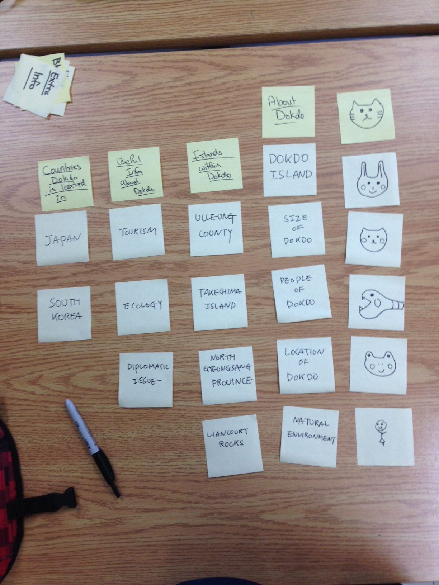
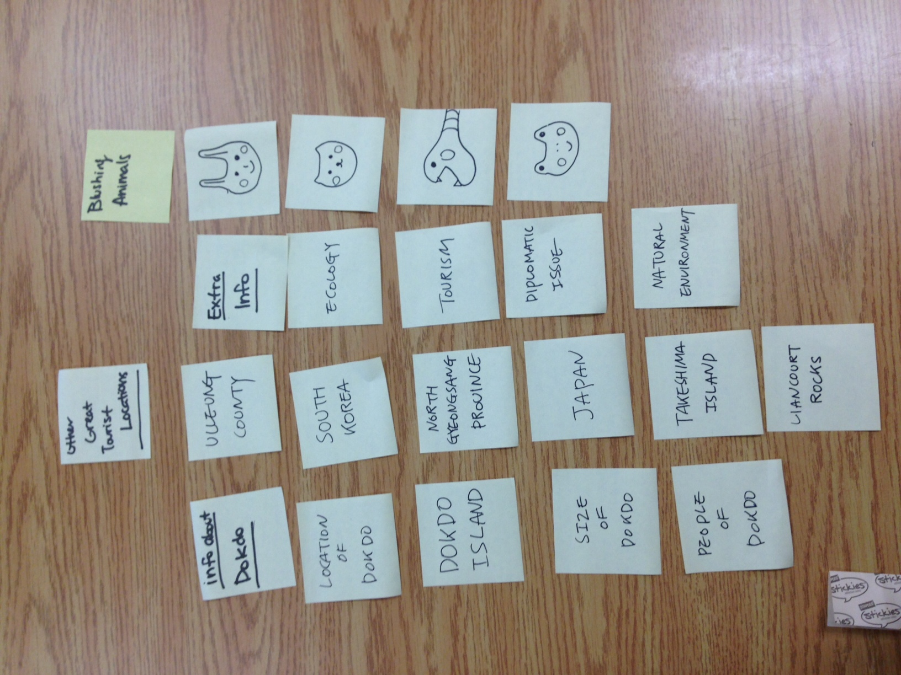

# Card sort report

The purpose of this card sort was to determine common navigation patterns and categories from the content of *Dokdo*.

## Specifics

The card sort was conducted by Kyounghee Lauren Lee on Oct.12th.2013 between the times of 4 and S6 with the following participants:

- Winnie Lau
- Mariam Abdulwahab

### Cards

15 cards were used covering a broad range of applicable content for the website. The following topics were used as cards:

1. Dokdo Island
2. South Korea
3. Japan
4. The name of Liancourt Rocks
5. Location of Dokdo
6. Size of Dokdo
7. Natural Environment
8. Tourism
9. People of Dokdo
10. Takeshima Island
11. North Gyeongsang Province
12. Ulleung county
13. Ecology
14. Diplomatic Issue
15. Dokdo Korean Territory

## Card sort results

*Card sort 1 by Mariam Abdulwabah*

*Card sort 2 by Winnie Lau*

## Observations 

- Did thise participants have any common comments?
	- They both commented on the about Dokdo called  Dokdo Island
- Did they struggle with certain articles or topics?
	- Yes. Because almost of contents are the name of city or, province, something like that. So they do not know what it is.
- Did they find common groupings? Or were the groupings completely different?
	- Not really
- Were the results similar to your expectations?
	- Same of the the results were similar to my expectations.
- How did you feel while watching them perform the task?
	- I felt curious about how they will sort them.